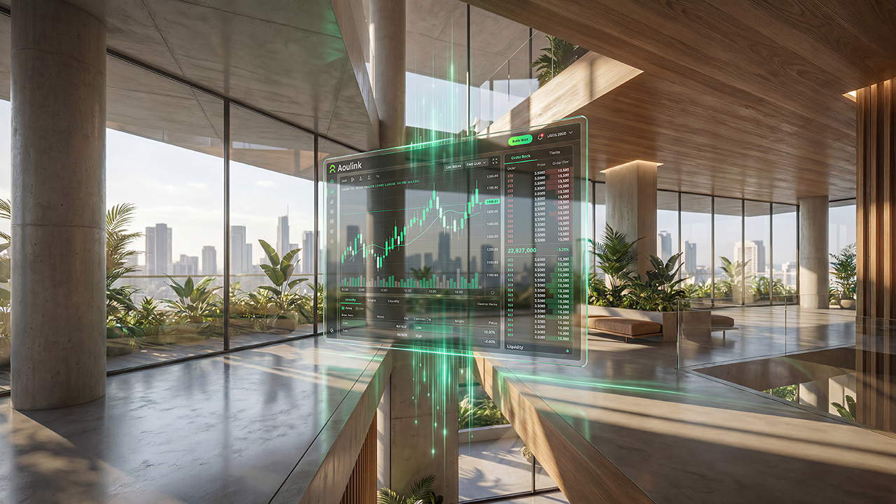

# AOULINK Ecosystem

AOULINK is building a decentralized Web3 ecosystem connecting blockchain infrastructure, perpetual trading, DeFi lending, wallets, AI analytics, and decentralized financial systems.

---

# Ecosystem

## AOULINK CHAIN
Scalable Layer-1 blockchain infrastructure.

## Perpetual Trading
Transparent decentralized trading systems.

## DeFi Lending
Blockchain-powered liquidity infrastructure.

## Wallet Ecosystem
Secure self-custody infrastructure.

## Cross-Chain Infrastructure
Connected decentralized ecosystems.

---

# Vision

Building the future of decentralized finance through scalable blockchain innovation.
